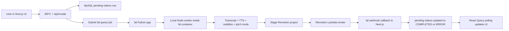
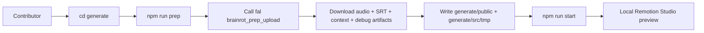
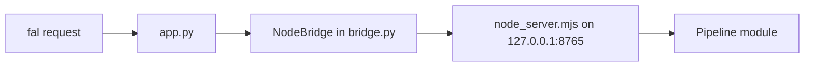

# Brainrot.js Architecture

This document is the contributor map for the Brainrot web app and its media-generation pipeline.

It explains:

- what lives in the Next.js app versus the `generate/` Remotion project versus the fal worker
- how React Query and tRPC are used together
- how a video request moves from the UI to the database to fal to Remotion Lambda and back
- how to test changes locally
- which parts of the repo are source code versus generated artifacts

If you are new to the project, start with:

1. `src/app/page.tsx`
2. `src/app/page-client.tsx`
3. `src/app/createvideo.tsx`
4. `src/app/api/create/route.ts`
5. `src/app/api/webhooks/fal/[videoId]/route.ts`
6. `fal/remotion_proxy_spike/node_server.mjs`
7. `fal/remotion_proxy_spike/brainrot_transcript_audio.mjs`
8. `generate/scripts/fetch-prep.mjs`
9. `generate/src/Root.tsx`
10. `generate/src/BrainrotComposition.tsx`

## 1. What this repo contains

The repo has three major systems:

1. The web app in `src/`
2. The Remotion render template in `generate/`
3. The fal app in `fal/remotion_proxy_spike/`

They work together like this:



There is also a second, developer-only path:



That second path is the fastest way to iterate on subtitle timing, pitch mode, composition layout, and general rendering behavior without using the full app flow every time.

## 2. Stack overview

### Web app stack

- Next.js App Router
- React 19
- TypeScript
- Clerk for auth
- tRPC for type-safe server procedures
- TanStack React Query for caching, hydration, polling, and mutations
- Drizzle ORM + `mysql2` for database access
- Zustand for lightweight client-only UI state
- SST/OpenNext for AWS deployment of the Next app

### Media / generation stack

- fal for remote job execution and container hosting
- Python fal app as the public fal entrypoint
- Local Node worker process inside the fal container for actual media orchestration
- MiniMax TTS for voice generation
- fal OpenRouter endpoint for transcript and pitch-mode phrase selection
- Python Whisper-based alignment + SRT generation
- Remotion for final composition
- Remotion Lambda for cloud rendering
- ffmpeg / ffprobe for audio transforms and inspection

## 3. Repo layout

### `src/`

This is the main web application.

- `src/app/`: App Router pages, layouts, client components, API routes
- `src/server/api/`: tRPC routers and server context
- `src/server/db/`: Drizzle schema and DB client
- `src/server/jobs/`: helper jobs like pending-video creation and ETA timing logic
- `src/server/fal/`: fal submission helpers used by the app
- `src/trpc/`: React Query + tRPC wiring for client and server
- `src/store/`: Zustand stores
- `src/lib/`: shared helpers, URL building, webhook helpers, utilities

### `generate/`

This is the Remotion project and local render playground.

- `generate/src/`: Remotion compositions and subtitle parsing
- `generate/src/tmp/`: generated context files downloaded by `npm run prep`
- `generate/public/`: staged assets like `audio.mp3`, `srt/`, `background/`, and debug artifacts
- `generate/scripts/fetch-prep.mjs`: downloads prep artifacts from fal for local preview

### `fal/remotion_proxy_spike/`

This is the deployed fal application.

- `app.py`: fal endpoint entrypoint
- `bridge.py`: Python helper that boots and talks to the local Node server
- `node_server.mjs`: local HTTP API inside the container
- `brainrot_transcript_audio.mjs`: transcript/audio/subtitle pipeline
- `brainrot_prep_upload.mjs`: prep pipeline that uploads artifacts for local Studio
- `remotion_brainrot_lambda_render.mjs`: production render pipeline
- `pitch_mode_audio.mjs`: pitch-mode segmentation and audio transformation
- `python_srt_pipeline.mjs`: JS wrapper around the Python subtitle pipeline
- `transcribe_and_generate_srt.py`: alignment, transcription, SRT generation, audio concat

## 4. The web app architecture

## 4.1 App shell and providers

The root layout is `src/app/layout.tsx`.

At the top of the tree it installs:

- `TRPCReactProvider`
- `ClerkProvider`
- `TooltipProvider`
- a local app `Providers` wrapper for theme, PostHog, and toast notifications

This means almost every page can assume:

- auth context is available
- React Query is available
- tRPC hooks are available
- toasts and theme support are available

## 4.2 tRPC and React Query

The project uses tRPC as the typed server API and React Query as the transport/cache layer.

### Client wiring

Client-side setup lives in:

- `src/trpc/react.tsx`
- `src/trpc/client.ts`
- `src/trpc/query-client.ts`

Important patterns:

- `TRPCReactProvider` creates a tRPC client using `httpBatchLink`
- it wraps that client in a shared React Query `QueryClientProvider`
- the QueryClient uses `superjson` for hydration and serialization
- browser code reuses a singleton QueryClient
- server code creates isolated QueryClients per request

This gives the app:

- typed procedures
- automatic React Query query keys
- SSR hydration
- cache invalidation via tRPC-generated query filters

### Server wiring

Server-side setup lives in:

- `src/server/api/trpc.ts`
- `src/server/api/root.ts`
- `src/app/api/trpc/[trpc]/route.ts`
- `src/trpc/server.tsx`

Important pieces:

- `createTRPCContext()` puts the request headers and DB client into context
- `protectedProcedure` and `subscribedProcedure` are auth-aware middlewares
- `appRouter` currently mounts `userRouter`
- App Router uses `fetchRequestHandler` to expose `/api/trpc`
- server components can prefetch or fetch tRPC procedures directly with `src/trpc/server.tsx`

### How React Query is used in practice

The homepage is a good example:

- `src/app/page.tsx` runs on the server
- it prefetches tRPC query options using `prefetchTRPC(...)`
- it wraps children in `HydrateClient`
- client components then call `useQuery(...)` with the same tRPC query options

That means contributors usually do not need to manually define query keys.

Typical pattern:

1. Server page prefetches `trpc.user.videoStatus.queryOptions()`
2. Client component calls `useQuery(trpc.user.videoStatus.queryOptions(...))`
3. React Query hydrates instantly from SSR
4. Later mutations invalidate with `queryClient.invalidateQueries(trpc.user.videoStatus.queryFilter())`

Polling uses React Query as well. For example, `src/app/page-client.tsx` polls `videoStatus` every 5 seconds while active jobs exist.

## 4.3 Zustand

Zustand is used for local UI state that does not belong in the server cache.

Examples:

- `src/app/usecreatevideo.tsx`: create-video dialog state and submitted values
- `src/app/usegenerationtype.ts`: selected generation mode and options
- `src/app/useyourvideos.tsx`: modal visibility
- `src/store/audioStore.ts`: global audio preview playback

Rule of thumb:

- use React Query for remote server state
- use Zustand for ephemeral client state

## 4.4 Auth

Clerk is used for authentication.

Key files:

- `src/app/layout.tsx`
- `src/server/api/trpc.ts`
- `src/proxy.ts`

tRPC auth middleware uses Clerk server auth to resolve the logged-in Clerk user and then maps that user to a row in the `brainrot-users` table.

## 4.5 Database and data model

The DB client is in `src/server/db/index.ts`.

The main schema is in `src/server/db/schemas/users/schema.ts`.

The most important tables for the generation flow are:

- `brainrot-users`
  - app users, credits, subscription state, API keys
- `pending-videos`
  - queue state for jobs in progress
  - stores status, progress, fal request id, webhook key hash, timing state, phase info
- `videos`
  - completed video outputs
- `rap_audio`
  - completed rap audio outputs
- `generation-timing-samples`
  - historical timing samples used to estimate ETA per mode

Very important contributor note:

- this repo currently uses `drizzle-kit push` via `npm run db:push`
- there are not checked-in SQL migrations in the normal way
- when you add or change schema fields, every environment that uses the code must receive a `db:push`

If the code and DB drift apart, webhook queries and tRPC queries can fail even if the code compiles.

## 5. The request lifecycle in the web app

This is the main brainrot video flow.

### Step 1: User fills out the dialog

The main UI lives in:

- `src/app/page-client.tsx`
- `src/app/createvideo.tsx`

The create dialog collects:

- topic / title
- speaker agents
- mode
- music
- output type
- pitch mode flag

### Step 2: Client validates and requests creation

`src/app/createvideo.tsx` first calls the tRPC mutation `user.createVideo`.

That mutation does not render the video. It does two things:

- validates the title via OpenAI
- decrements credits and returns the user API key if the request is allowed

### Step 3: Client calls `/api/create`

After the tRPC mutation succeeds, the client calls `POST /api/create`.

This route:

- authenticates with the stored API key
- creates a row in `pending-videos`
- creates a per-job fal webhook key
- builds the callback URL
- submits a fal queue job

Key files:

- `src/app/api/create/route.ts`
- `src/server/jobs/create-pending-video.ts`
- `src/server/fal/brainrot-render-test.ts`
- `src/lib/fal-jobs.ts`

### Step 4: The UI polls job state

The homepage and test page poll `user.videoStatus`.

This query:

- loads the user’s pending jobs
- loads other pending jobs to estimate queue position
- reads timing samples from `generation-timing-samples`
- computes ETA and queue-aware timing estimates

This is why the UI can show both raw progress and smarter timing information.

### Step 5: fal sends webhook callbacks

The fal worker posts progress updates and final completion/error payloads to:

- `src/app/api/webhooks/fal/[videoId]/route.ts`

That webhook route:

- verifies the per-job webhook key hash
- updates progress and timing state
- writes completed videos into `videos` or `rap_audio`
- refunds credits on errors
- writes timing samples on completion or failure

### Step 6: React Query sees updated state

The client is still polling `videoStatus`, so once the webhook updates the DB:

- the UI progress changes
- the job moves to `COMPLETED` or `ERROR`
- the page invalidates `userVideos`
- completed items show up in the gallery

## 6. The fal app architecture

## 6.1 Why there is both Python and Node

The public fal app is Python, but the media pipeline is orchestrated in Node.

That split is intentional:

- fal’s app surface is Python (`app.py`)
- Remotion and most media orchestration code is easiest to keep in Node
- the Python side owns the public endpoint and lifecycle
- the Node side runs as a localhost worker inside the same container

The bridge looks like this:



## 6.2 `app.py`

`fal/remotion_proxy_spike/app.py` defines the fal app.

Responsibilities:

- build the fal container image from `Dockerfile`
- start `NodeBridge` during `setup()`
- expose `/health`, `/egress`, and `/`
- forward render requests to the local Node server
- upload the final rendered video to fal-hosted storage if the Node side returns a local path
- send webhook callbacks for `COMPLETED` or `ERROR`

## 6.3 `bridge.py`

`fal/remotion_proxy_spike/bridge.py` starts and manages the local Node process.

Responsibilities:

- locate Node
- spawn `node_server.mjs`
- health-check the local Node API
- proxy JSON requests to `/render`

This file is also what powers `local_smoke_test.py`, so it is the easiest way to exercise the fal Node worker locally without actually going through deployed fal.

## 6.4 `node_server.mjs`

`fal/remotion_proxy_spike/node_server.mjs` is a tiny localhost router inside the fal container.

It dispatches based on `props.pipeline`.

Current important pipelines:

- `brainrot_transcript_audio`
- `brainrot_prep_upload`
- `brainrot_lambda_render`

This means the fal “app” is really a small pipeline host with multiple entry modes under one deployed endpoint.

## 7. The media pipeline

## 7.1 `brainrot_transcript_audio`

This is the core prep pipeline in `fal/remotion_proxy_spike/brainrot_transcript_audio.mjs`.

Responsibilities:

1. Generate the transcript
2. Select slow moments for pitch mode
3. Generate one TTS clip per dialogue line
4. Optionally split those clips into fast/slow subsegments for pitch mode
5. Align the spoken audio to transcript words
6. Generate SRT files
7. Concatenate the final audio
8. Write a context file consumed by Remotion
9. Write a manifest file for debugging

### Transcript generation

Transcript generation currently uses fal’s OpenRouter endpoint and returns a structured JSON transcript.

The transcript is normalized into dialogue entries shaped like:

- `agentId`
- `text`

### Pitch mode

Pitch mode is a second structured LLM pass. It does not output timestamps.

It outputs phrase selections like:

- dialogue entry index
- phrase to emphasize
- optional reason

Then the code resolves that phrase back onto transcript word indices.

After that, the system aligns the unsplit TTS audio to recognized words, converts chosen word ranges into time ranges, and uses those ranges to split the original dialogue clip into ordered fast/slow/fast segments.

The important detail is:

- phrase selection is text-based
- timestamps come from the alignment pass
- final SRT files are downstream of the audio segmentation, not the source of the cuts

### Output artifacts

This pipeline writes:

- `transcript.json`
- `context.tsx`
- `audio.mp3`
- merged dialogue SRT files
- `audio-manifest.json`
- optional debug voice clips and pitch segments

## 7.2 `pitch_mode_audio.mjs`

This file handles the actual segment math and audio rendering.

Responsibilities:

- merge overlapping or adjacent slow word ranges
- derive segment boundaries from aligned words
- preserve dialogue ordering
- transform segment speed for fast and slow regions
- keep track of `silenceAfterSeconds` so only dialogue boundaries get the normal inter-speaker gap

The current design emits ordered segment files like:

- `JOE_ROGAN-1-0-fast.mp3`
- `JOE_ROGAN-1-1-slow.mp3`
- `JOE_ROGAN-1-2-fast.mp3`

The subtitle pipeline later merges those split SRTs back into one per dialogue turn, so the Remotion layer still reasons in terms of dialogue switches rather than subsegments.

## 7.3 `python_srt_pipeline.mjs` and `transcribe_and_generate_srt.py`

These files own alignment and SRT generation.

JS wrapper responsibilities:

- locate Python
- call the Python script
- support mock output mode
- merge split pitch-mode SRT files back into one dialogue-level SRT per turn

Python responsibilities:

- transcribe audio
- align transcript words to recognized words
- build per-word timings
- write SRT files with global timeline offsets
- concatenate audio with speaker gaps

The Python aligner is the source of truth for word timing.

## 7.4 `brainrot_prep_upload`

This pipeline exists specifically for local Remotion Studio development.

`fal/remotion_proxy_spike/brainrot_prep_upload.mjs`:

- runs `brainrot_transcript_audio`
- uploads resulting artifacts to fal storage
- returns URLs for:
  - `audio.mp3`
  - `context.tsx`
  - `transcript.json`
  - `audio-manifest.json`
  - merged SRT files
  - original per-dialogue voice clips
  - pitch-mode split clips

That return value is what `generate/scripts/fetch-prep.mjs` downloads.

## 7.5 `brainrot_lambda_render`

This is the production render path in `fal/remotion_proxy_spike/remotion_brainrot_lambda_render.mjs`.

Responsibilities:

1. Run the same prep pipeline as above
2. Materialize a temporary Remotion project in `/tmp`
3. Copy staged assets into that temp project
4. Call `remotion lambda sites create`
5. Call `remotion lambda render`
6. Optionally extract a thumbnail
7. Return the output video URL

Important design choice:

- the deployed fal worker owns prep and Remotion Lambda invocation
- the web app does not render video itself

## 8. The `generate/` folder

`generate/` is the Remotion template plus local preview environment.

Think of it as a render consumer, not the generation engine.

It expects assets to already exist.

## 8.1 What gets staged into `generate/`

After `npm run prep`, these are the most important local artifacts:

- `generate/public/audio.mp3`
- `generate/public/srt/*.srt`
- `generate/src/tmp/context.tsx`
- `generate/src/tmp/transcript.json`
- `generate/src/tmp/audio-manifest.json`
- `generate/public/debug/voice/...`
- `generate/public/debug/voice-pitch/...`

You should treat `generate/src/tmp/*` and most of `generate/public/srt` as generated files.

## 8.2 `generate/src/Root.tsx`

This is the Remotion composition registration point.

It reads runtime values from `generate/src/tmp/context.tsx`:

- `music`
- `initialAgentName`
- `subtitlesFileName`
- `videoFileName`
- `videoMode`

It then registers the appropriate composition and computes duration from the staged `audio.mp3`.

## 8.3 `generate/src/BrainrotComposition.tsx`

This is the brainrot video renderer.

Responsibilities:

- load `audio.mp3`
- load each SRT file listed in context
- parse and flatten subtitles into a single time-sorted stream
- drive background video, speaker avatar, and subtitle rendering

Important note:

- Remotion does not know anything about pitch-mode slow or fast labels
- it simply receives dialogue-level SRT files and a final mixed `audio.mp3`

## 8.4 `generate/scripts/fetch-prep.mjs`

This is the bridge between remote fal prep and local Remotion Studio.

It:

- submits the `brainrot_prep_upload` pipeline to fal
- polls until completion
- downloads the artifact bundle
- clears the old generated assets
- writes fresh files into `generate/public` and `generate/src/tmp`

If you are working on subtitle behavior, pitch mode, composition layout, or avatar timing, this script is the usual starting point.

## 8.5 `generate/build.ts`

`generate/build.ts` is an older direct pipeline that also talks to the DB and Remotion Lambda.

It is still useful historical context, but contributors should think of it as legacy compared with the newer fal-based flow:

- current prep path: `brainrot_prep_upload`
- current production path: `brainrot_lambda_render`

If you are making changes to the modern generation system, start in `fal/remotion_proxy_spike/`, not `generate/build.ts`.

## 9. Local development workflows

## 9.1 Web app only

From the repo root:

```bash
npm run dev
```

Use this when you are working on:

- UI
- tRPC
- database queries
- auth
- checkout / credits flows
- queue polling screens

Note:

- root `npm run start` is the production Next server, not the main dev command
- contributors usually want `npm run dev` locally

## 9.2 Push schema changes

If you changed Drizzle schema files:

```bash
npm run db:push
```

This is required because the app expects live DB columns to match the code.

If you skip this, webhook queries and tRPC queries can fail at runtime.

Before you run it, double-check which database `DB_URL` points at. This command pushes schema directly to the configured database.

## 9.3 Fastest local fal smoke test

To exercise the fal Node pipeline locally without deploying:

```bash
python3 fal/remotion_proxy_spike/local_smoke_test.py
python3 fal/remotion_proxy_spike/local_smoke_test.py --pipeline brainrot_prep_upload --mock-services
python3 fal/remotion_proxy_spike/local_smoke_test.py --pipeline brainrot_prep_upload --pitch-mode
```

Use mock services first when you are debugging control flow instead of external dependencies.

This path exercises:

- `bridge.py`
- `node_server.mjs`
- the pipeline dispatch layer

It does not test deployed fal queue behavior or webhooks.

## 9.4 Deploy fal changes

From `fal/remotion_proxy_spike/`:

```bash
./.venv/bin/fal deploy app.py::RemotionProxySpike
```

Use this when your change needs a real remote fal runner:

- OpenRouter calls
- MiniMax voice generation
- fal storage uploads
- Remotion Lambda rendering

## 9.5 Local Remotion Studio workflow

This is the main contributor loop for media/render work.

From `generate/`:

```bash
npm run prep -- --topic "iran war" --agentA BARACK_OBAMA --agentB JOE_ROGAN --pitchMode
npm run start
```

What happens:

1. `npm run prep` calls the deployed fal `brainrot_prep_upload` pipeline
2. fal generates audio, subtitles, manifest, and context
3. the script downloads those assets locally
4. `npm run start` opens Remotion Studio against the staged assets

Important:

- `npm run prep` does not execute your local fal code directly
- it hits the deployed fal endpoint configured by `FAL_REMOTION_SPIKE_ENDPOINT_ID` or the default app id
- if you changed code in `fal/remotion_proxy_spike/`, deploy it first if you want `prep` to exercise the new version

Important clarification:

- inside `generate/`, `npm run start` means Remotion Studio
- at the repo root, `npm run start` means `next start`

## 9.6 Inspect debug artifacts locally

After a prep run, inspect:

- `generate/src/tmp/audio-manifest.json`
- `generate/src/tmp/transcript.json`
- `generate/public/debug/voice/`
- `generate/public/debug/voice-pitch/`

These files are extremely useful when debugging:

- pitch-mode phrase choice
- alignment drift
- audio segment boundaries
- merged versus split SRT behavior

## 9.7 Webhook / queue integration testing

The repo includes a test page at `/test`.

It can:

- create a real pending job
- submit the deployed fal app
- poll `videoStatus`
- observe how webhooks flow back into the same UI state the homepage uses

This is the best test when you need to validate:

- webhook signing
- queue status updates
- DB writes
- timing estimates

## 9.8 Inspect fal runner logs

Useful commands:

```bash
cd fal/remotion_proxy_spike
./.venv/bin/fal apps list
./.venv/bin/fal apps runners noah-t9ec484ea829/remotion-proxy-spike
./.venv/bin/fal runners logs <runner-id>
```

Use runner logs when:

- `npm run prep` stalls or fails remotely
- callbacks do not make it back to the app
- the Lambda render path fails inside fal

## 10. Contributor gotchas

## 10.1 Local callbacks do not work unless the webhook URL is public

The fal worker cannot call `localhost`.

Webhook URLs are built from:

- `FAL_WEBHOOK_BASE_URL`
- or `NEXT_PUBLIC_APP_URL`
- or `WEBSITE`

If your local `.env` only has `WEBSITE=brainrotjs.com`, the fal worker will call production webhooks even when you launched the job from local code.

For local webhook testing, point `FAL_WEBHOOK_BASE_URL` at a public tunnel to your local app.

## 10.2 DB schema drift is easy to miss

Because this repo uses `drizzle-kit push`, you must remember to push schema changes to the environment you are testing.

Symptoms of schema drift include:

- webhook `500` on `pending-videos` queries
- DB fields appearing in code but not in MySQL
- successful fal jobs that never update the UI

## 10.3 `generate/src/tmp` is generated

Do not hand-edit these as source files:

- `generate/src/tmp/context.tsx`
- `generate/src/tmp/transcript.json`
- `generate/src/tmp/audio-manifest.json`

They are overwritten by `npm run prep`.

## 10.4 `generate/public/debug` is for debugging, not app logic

The debug voice files are there so contributors can inspect segmentation and timing problems.

The production render path does not rely on those files being present locally.

## 10.5 There are two valid ways to preview changes

Choose based on what changed:

- web/UI/tRPC/auth/DB change: run the main app
- media/subtitles/pitch mode/composition change: run `generate` prep + Studio

## 11. Suggested starting points for common changes

### UI or queue-state changes

Start in:

- `src/app/page-client.tsx`
- `src/app/createvideo.tsx`
- `src/server/api/routers/users.ts`

### tRPC / React Query behavior

Start in:

- `src/trpc/react.tsx`
- `src/trpc/server.tsx`
- `src/server/api/trpc.ts`

### DB / webhook / ETA behavior

Start in:

- `src/server/db/schemas/users/schema.ts`
- `src/server/jobs/create-pending-video.ts`
- `src/server/jobs/generation-timing.ts`
- `src/app/api/webhooks/fal/[videoId]/route.ts`

### fal pipeline / transcript / pitch mode / SRT issues

Start in:

- `fal/remotion_proxy_spike/brainrot_transcript_audio.mjs`
- `fal/remotion_proxy_spike/pitch_mode_audio.mjs`
- `fal/remotion_proxy_spike/python_srt_pipeline.mjs`
- `fal/remotion_proxy_spike/transcribe_and_generate_srt.py`

### Remotion composition / subtitle rendering

Start in:

- `generate/src/Root.tsx`
- `generate/src/BrainrotComposition.tsx`
- `generate/src/composition_helpers.tsx`
- `generate/src/Subtitles.tsx`

## 12. Mental model to keep in your head

The simplest accurate model is:

- the web app owns users, credits, job creation, status polling, and webhook persistence
- fal owns the expensive generation work
- the `generate/` folder is the Remotion consumer and local preview surface
- React Query is the app’s remote state cache
- tRPC is the typed API contract layered on top of React Query
- `pending-videos` is the operational queue table that ties the whole system together

If you remember those five boundaries, most of the repo becomes much easier to reason about.
